# Как российский фондовый рынок изменился за последние 20 лет

Данная визуализация показывает объём торгов по стоимости и количеству сделок, капитализацию рынка. Доступно два типа визуализации: в динамике (histogram) и в разрезе (treemap).

Мосбиржа предоставляет данные с декабря 2011 года. За прошедшие 23 года общая рублёвая капитализация компаний, представленных на бирже, удвоилась: с 24 до 50 триллиона. Если посмотреть этот же график в других валютах, увидим что рубль потерял 2/3 стоиомсти, а общая капитализация рынка снизилась примерно на четверть.

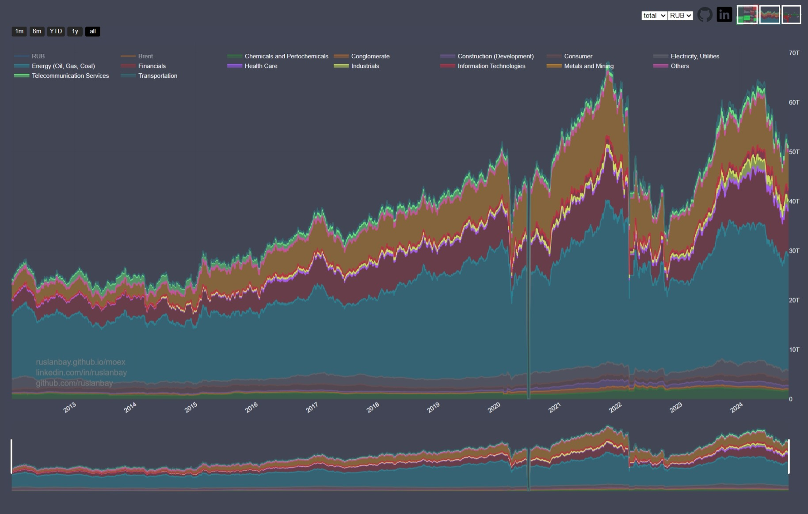

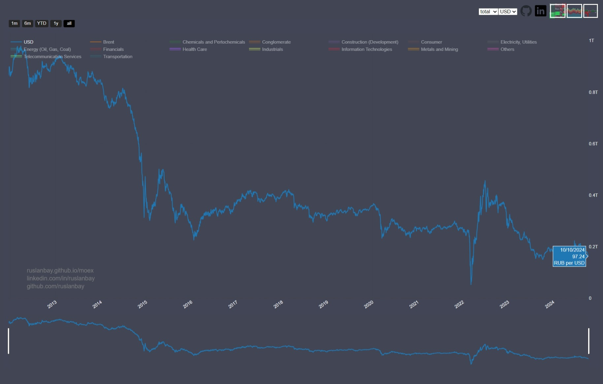

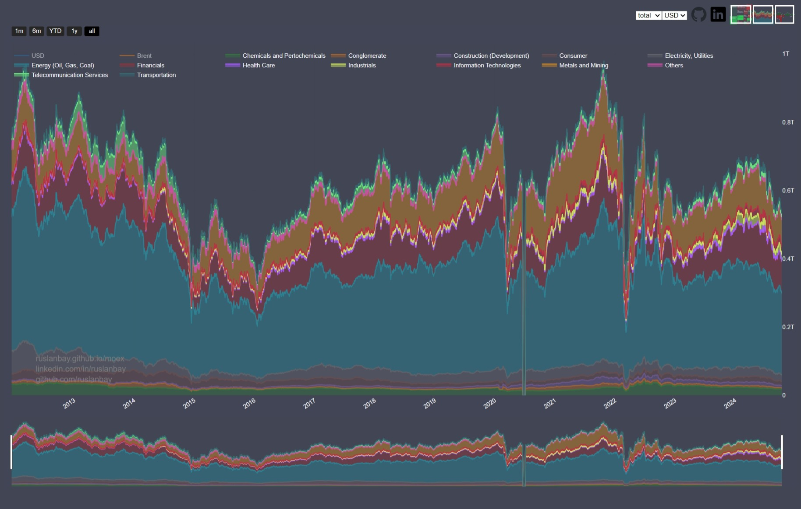

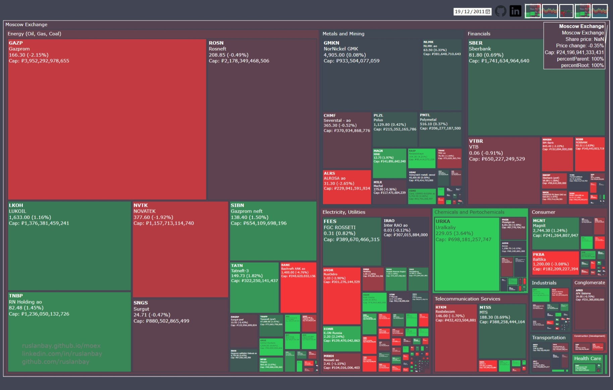

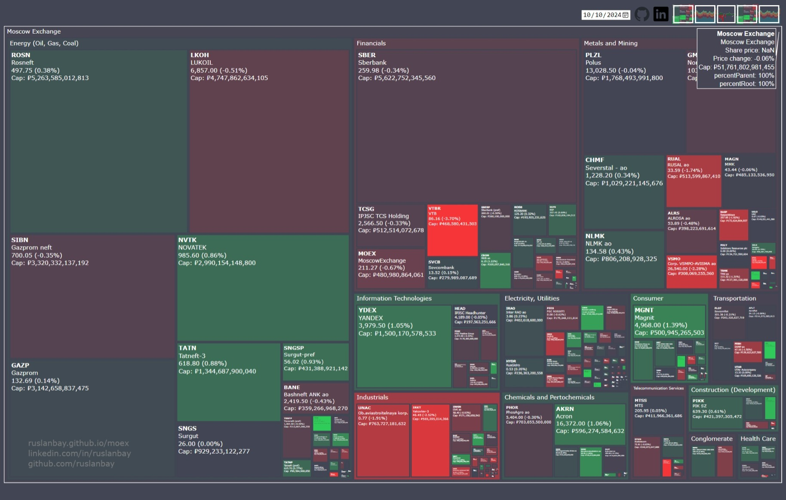

Число отечественных компаний, представленных на бирже, достигло пика в ноябре 2012 года и с тех пор снижается.

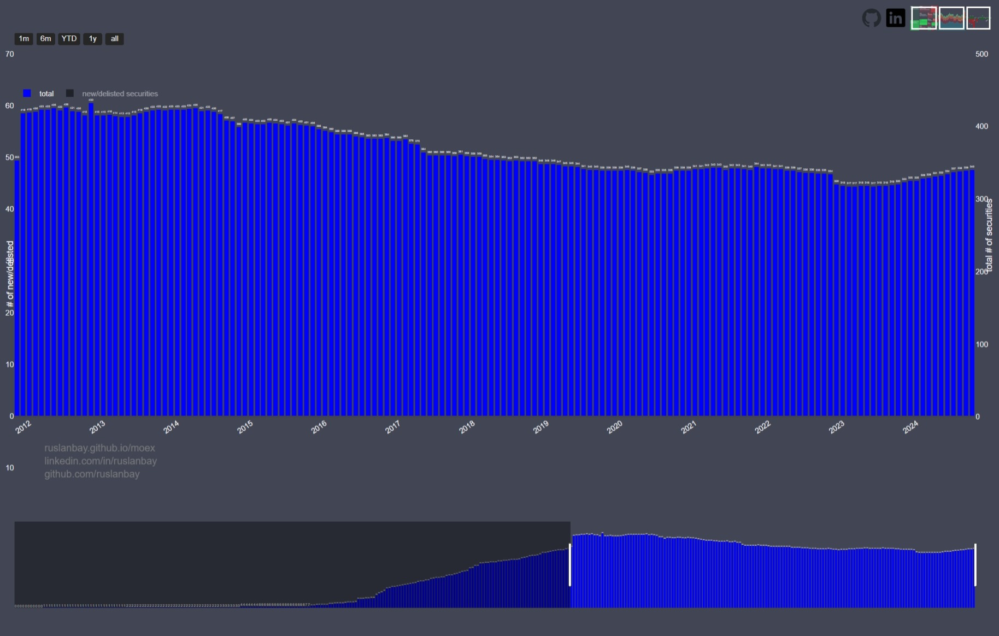

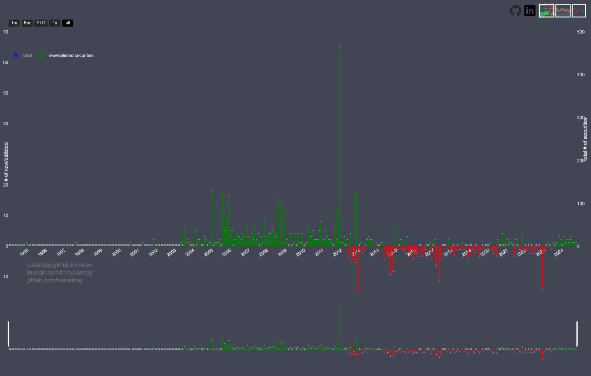

Ниже таблица с распределением секторов в общей капиталазации рынка.

|Сектор                    |2011-12-19|2024-11-14|
|--------------------------|----------|----------|
|Нефть, газ                |52%       |44%       |
|Финансы                   |12%       |19%       |
|Металлы                   |12%       |15%       |
|Информационные технологии |0.04%     |4.1%      |
|Электроэнергетика         |9%        |3.8%      |
|Химпром и нефтехимия      |4%        |3.4%      |
|Промышленность            |1.1%      |3%        |
|Транспорт                 |0.85%     |2%        |
|Потребительский сектор    |2.7%      |2%        |
|Телекоммуникации          |3.8%      |1.6%      |
|Строительство             |0.37%     |1.1%      |
|Холдинги                  |0.96%     |0.68%     |
|Здравоохранение           |0.33%     |0.58%     |

Из-за большой доли нефтегазовых компаний-экспортёров, курс рубля и капитализация рынка коррелируют со стоимостью нефти.

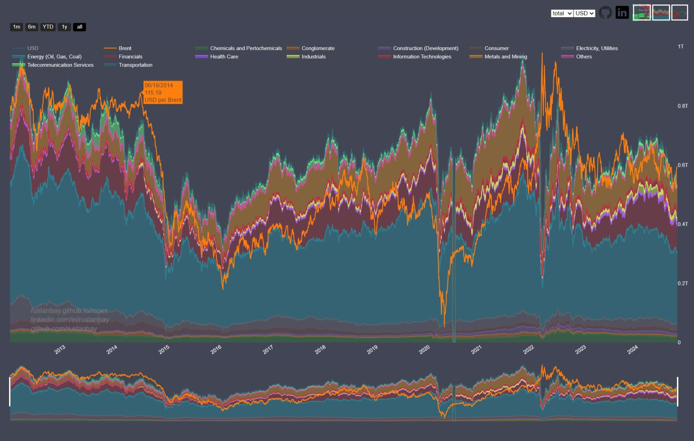
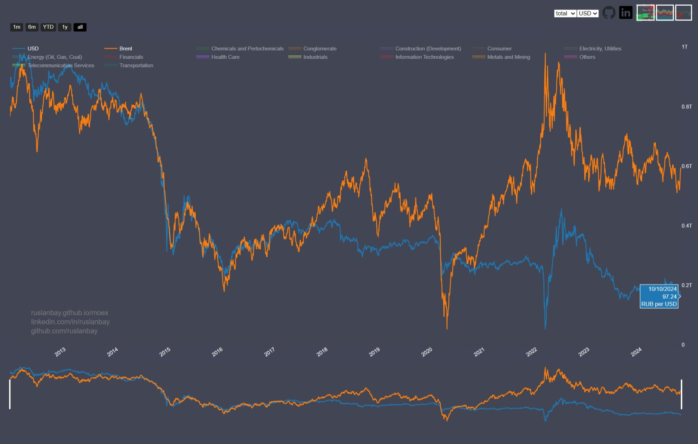

В 2017 году ЦБР начал применять бюджетное правило, согласно которому бюджет формировался исходя из ожидаемой стоимости Urals в 40 USD, "излишки" в виде иностранной валюты и драгметаллов направлялись в ФНБ. Последующие три года, благодаря этой мере, несмотря на дорожавшую нефть, рубль оставался стабильным. Дешёвый по отношению к нефти рубль помог компаниям-экспортёрам снизить издержки и принёс им дополнительную прибыль.

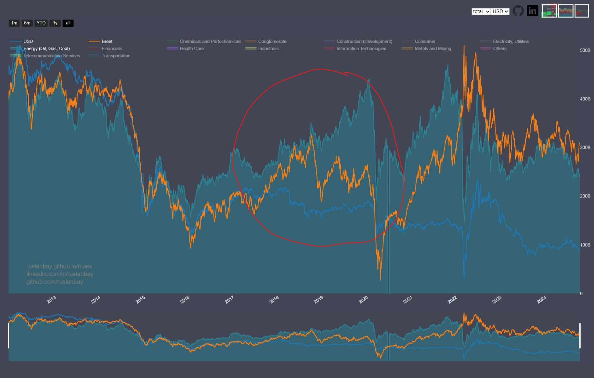

По объёмам торгов я заметил растущую популярность ETF денежного рынка. Они появились почти одновременно - в середине 2022 года и с тех пор их доля в объёме торгов выросла с 0.8% до 12% или с 0.45 до 19 млрд. рублей. Насколько понимаю, это связано с ростом ключевой ставки и доходности облигаций.

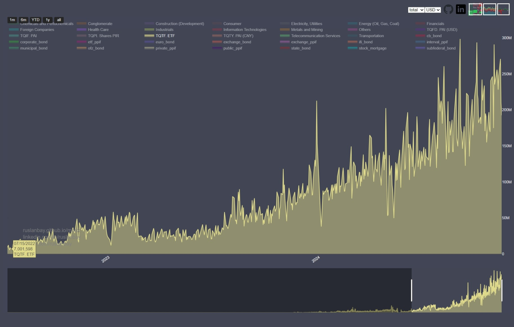
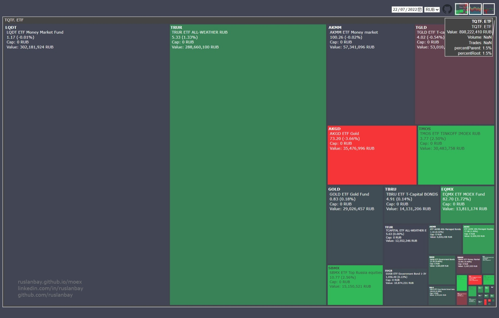
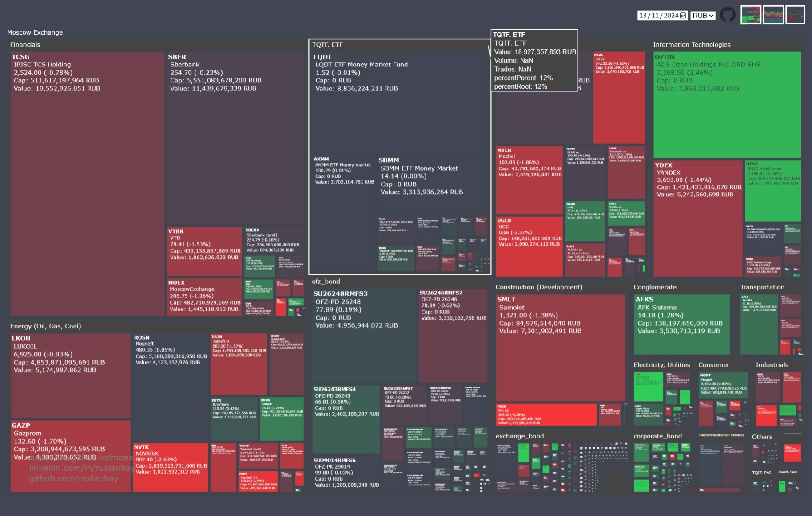

Объём торгов ETF денежного рынка сравним с объёмами торгов нескольких отраслей вместе взятых. Из-за высокой ключевой ставки рынок долговых бумаг выглядит привлекательнее инвестиций в акции:

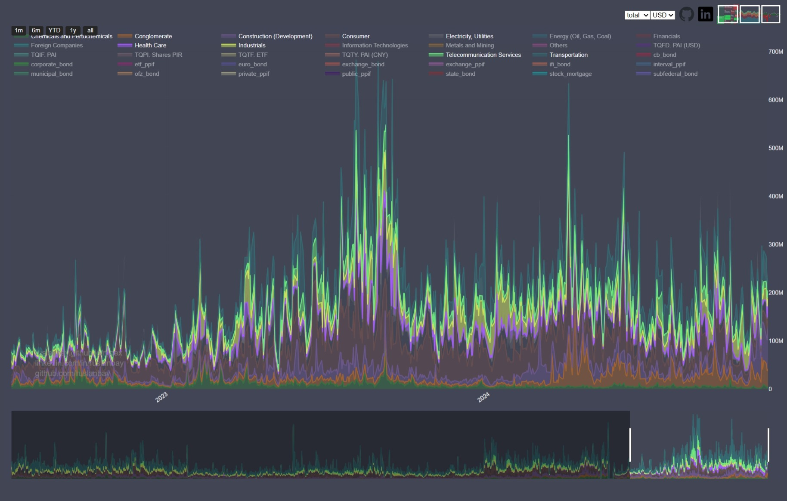

Посмотреть графики можно на странице [ruslanbay.github.io/moex](http://ruslanbay.github.io/moex). Данные обновляются ежедневно.

JS - не моя стихия, не судите код строго, он просто работает =)