# How the Russian stock market has changed over the past 20+ years

Currently, I do not have any shares of Russian companies in my portfolio, but I continue to follow the news and its impact on the market out of habit. Previously, I published a visualization for the Moscow Exchange in the form of a [treemap](https://ruslanbay.github.io/moex). Recently, I added a [histogram](https://ruslanbay.github.io/moex/history/) to display the changes in the ruble exchange rate and market capitalization over time. I also included a [bar chart](https://ruslanbay.github.io/moex/listings/) that shows the total number of Russian company shares listed on the Moscow Exchange. Below is a brief analysis.

At first glance, over the past 23 years, the total market capitalization of Russian companies listed on the Moscow Exchange has nearly doubled: from 24 trillion to 54 trillion rubles.

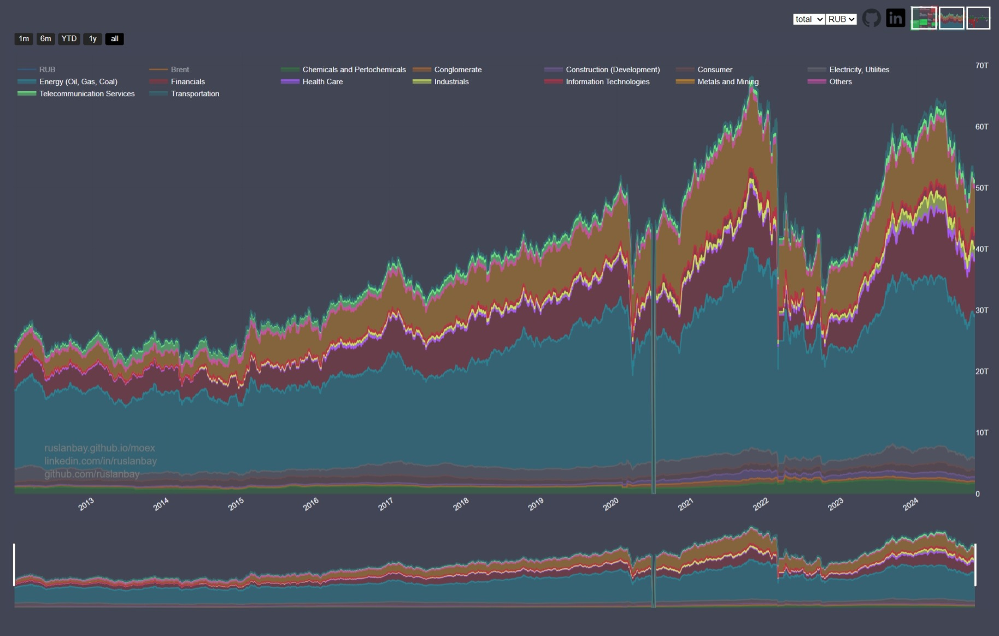 
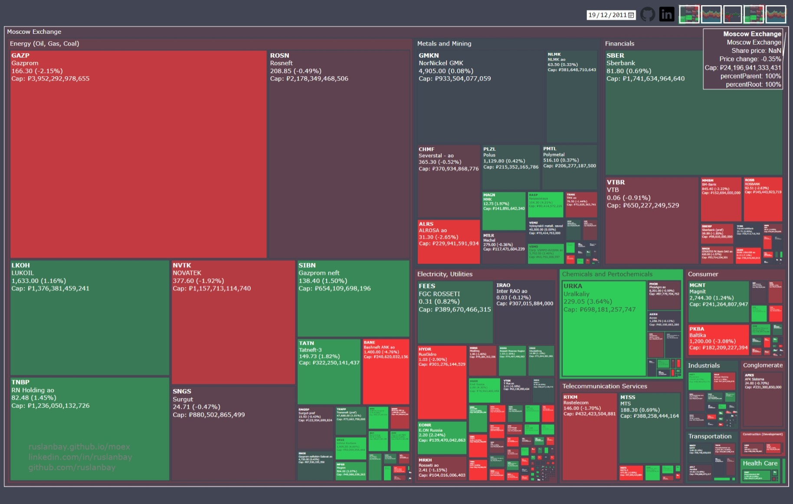 
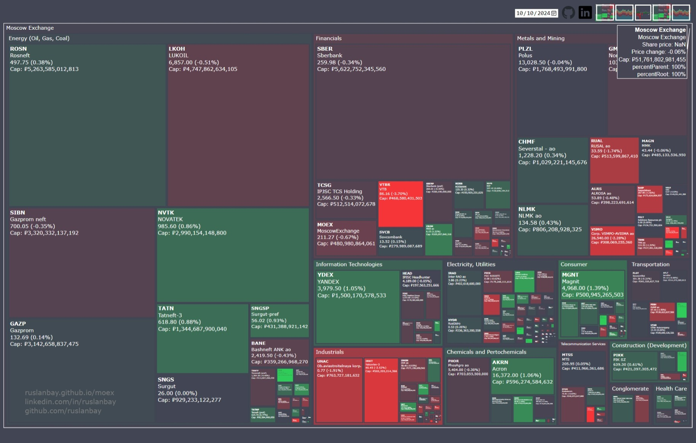

But in December 2011, 401 shares of Russian companies were traded on the exchange, and the US dollar cost 32 rubles. Now the number of shares has dropped to 329, and the national currency exchange rate has plummeted three times to 92 rubles per US dollar.

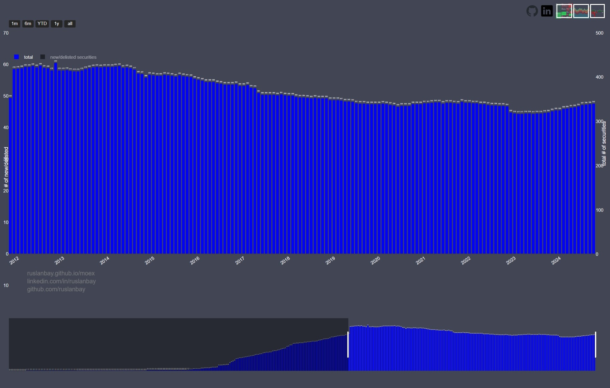 
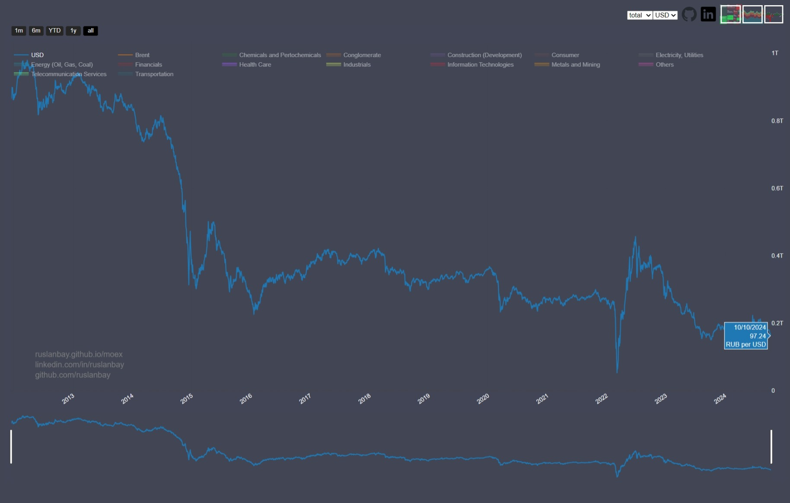

Taking these two facts into account, the total market capitalization has fallen from 753 billion to 579 billion USD.

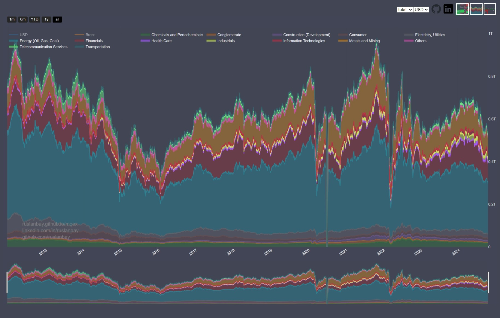

The number of shares on the Moscow Exchange peaked in 2014 and has been declining since then.

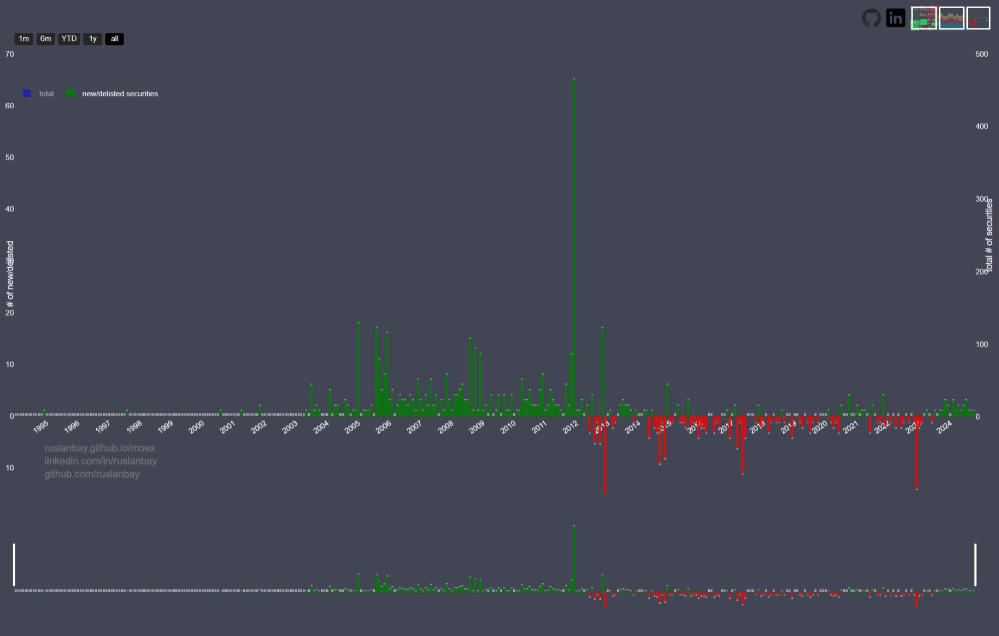

The Russian economy relies heavily on oil prices.

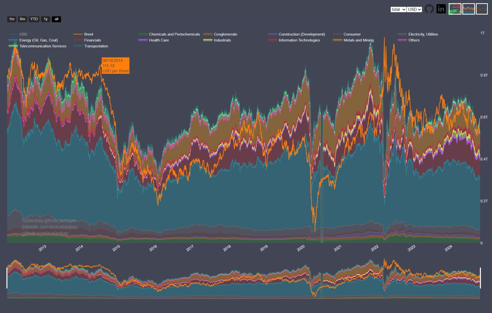

The exchange rate of the ruble is largely influenced by the movement of oil prices. Since 2017, the Central Bank of Russia has implemented a so-called "budget rule." According to this rule, the budget is formed based on an assumed price of Urals oil at $40. During periods when oil prices exceed this threshold, additional revenues are directed to a stabilization fund. This measure has effectively reduced the impact of oil prices on the ruble.

This measure also led to an increase in the market capitalization of oil-exporting companies.

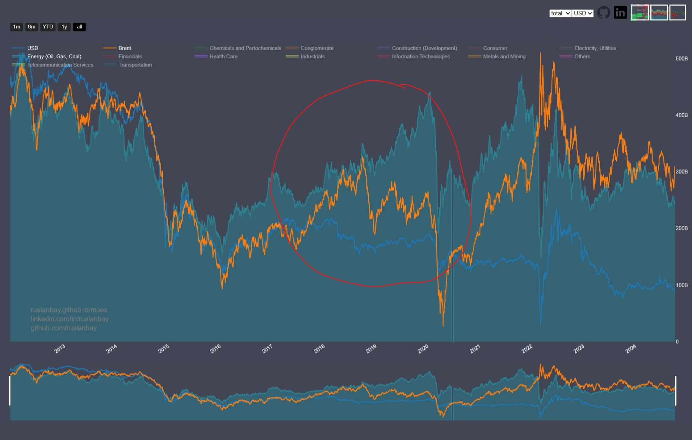

The capitalization of most sectors is declining or stagnating. There are two exceptions: the industrial sector and information technology. Industrial sector capitalization tripled over the past three years, peaked in January 2024 and has been declining ever since. The information technology sector is highly volatile.

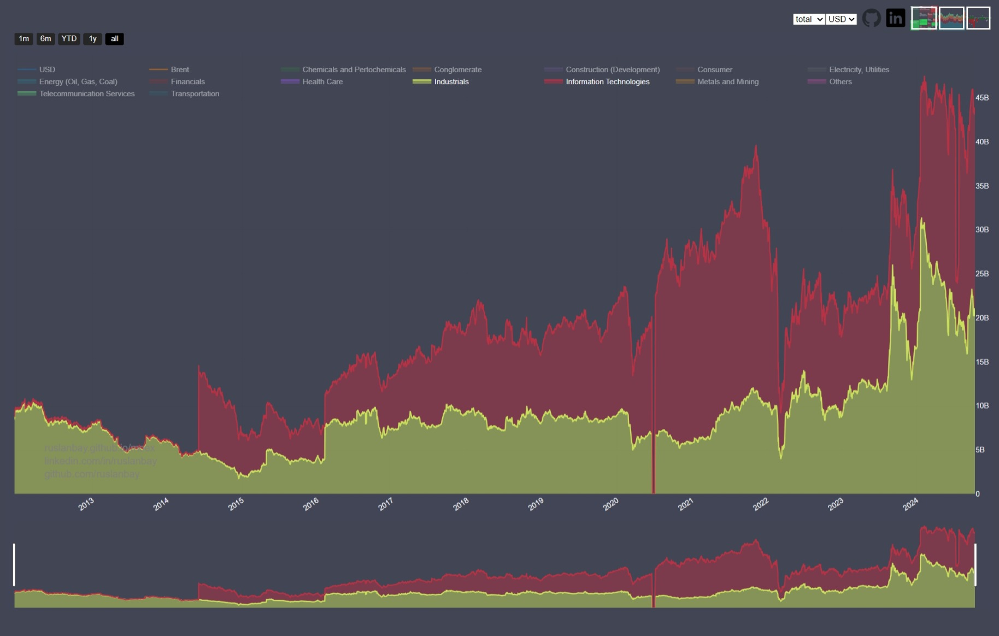

The largest sector includes oil, gas, and coal mining companies. Since 2012, its share has decreased from 52% to 44% of the total market capitalization.

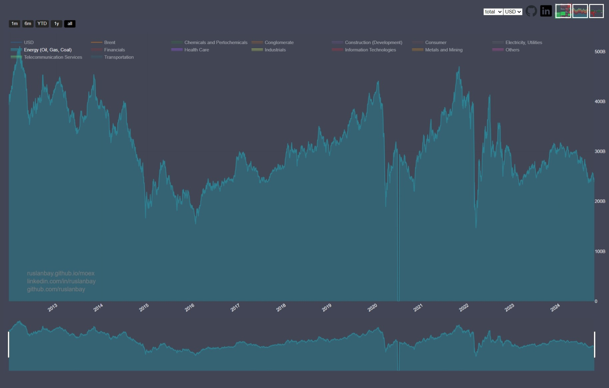
